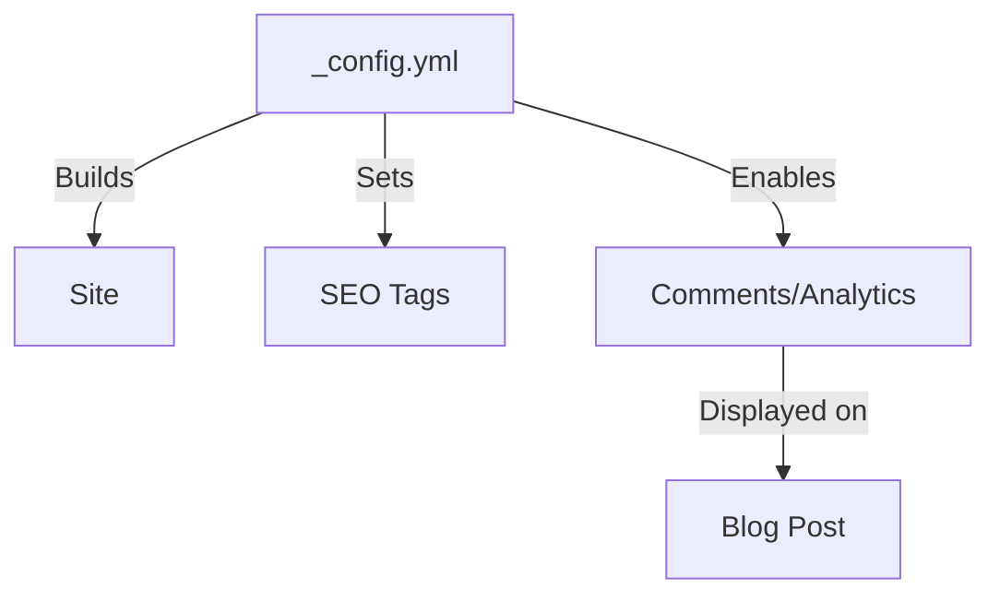

## Objective

In this post, we will walk through the essential configuration steps to get your [Jekyll Chirpy](https://github.com/cotes2020/jekyll-theme-chirpy) blog up and running. We'll cover everything from basic site metadata to enabling comments and analytics.

## Prerequisites

- A Jekyll site with the Chirpy theme installed.
- Basic knowledge of `_config.yml` and YAML syntax.

> Environment Used
> 
> | Software | Version |
> | :------- | :------ |
> | Jekyll   | 4.3.3   |
> | Chirpy   | 6.3.1   |
>
{: .prompt-tip }

## Overview

The Chirpy theme is highly customizable through the `_config.yml` file. Understanding the key sections of this file is crucial for tailoring your blog to your needs.

### Key Configuration Areas

1.  **Site Identity**: Title, tagline, and description.
2.  **Author Information**: Name, avatar, and social links.
3.  **Features**: Dark mode, table of contents (TOC), and math support.

## Implementation

### 1. Setting Up Site Identity

Open your `_config.yml` and locate the site settings block.

```yaml
title: My Awesome Blog
tagline: Learning and Sharing
description: >-
  A personal blog where I share my journey as a software engineer.
url: "https://username.github.io"
```

### 2. Configuring the Sidebar

The sidebar is the main navigation hub. You can customize the avatar and the "About" information.

```yaml
avatar: /assets/img/avatar.jpg # Ensure this file exists!
social:
  name: Your Name
  links:
    - https://github.com/username
    - https://twitter.com/username
```

### 3. Enabling Comments (Giscus)

Chirpy supports multiple comment systems. [Giscus](https://giscus.app) is a popular choice for developer blogs as it uses GitHub Discussions.

To enable it, first generate your configuration on the Giscus website, then update `_config.yml`:

```yaml
comments:
  provider: giscus
  giscus:
    repo: username/repo-name
    repo_id: [YOUR_REPO_ID]
    category: General
    category_id: [YOUR_CATEGORY_ID]
```

### Visualizing the Config Flow

Here is how the configuration propagates to the site:



## Verification

To verify your changes, build the site locally:

```bash
docker compose up
```

Visit `http://localhost:4000` and check:
- [x] Does the sidebar show your avatar?
- [x] Are the title and tagline correct?
- [x] Do comments appear at the bottom of posts?

## Conclusion

Configuring Chirpy is straightforward once you know where to look. By setting up your identity, sidebar, and interactive features, you create a professional and engaging blog.

For more advanced customizations, refer to the [official Wiki](https://github.com/cotes2020/jekyll-theme-chirpy/wiki).
